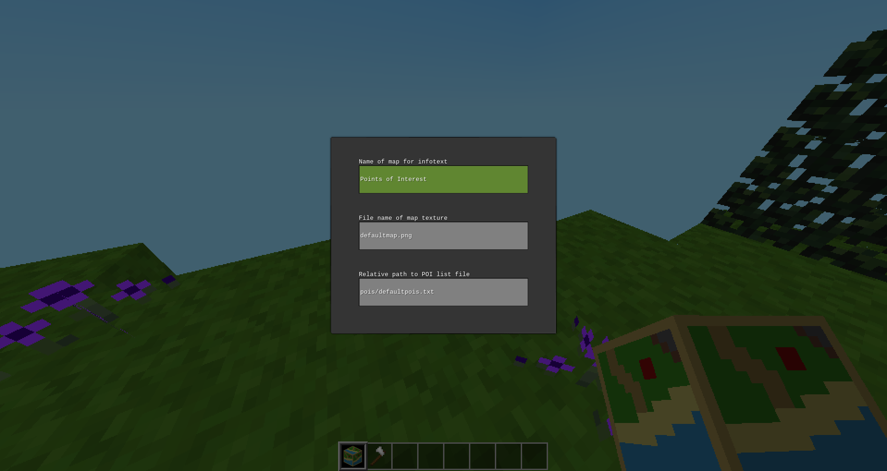
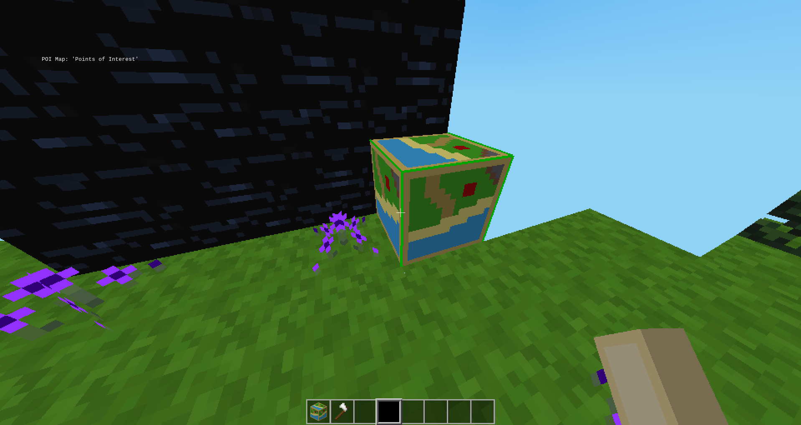
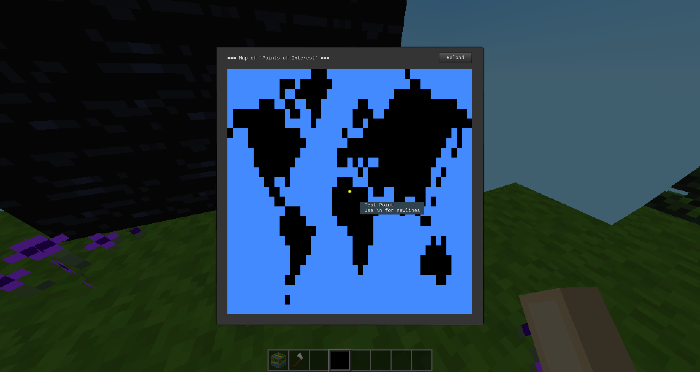

# MTPOIMAP

A Minetest mod for displaying a map with points of interest, for any game (no dependencies).

You must have administrative powers to set up POI Maps, but anyone can use one.
POI Maps are uncraftable and inaccessible from the creative inventory. They can
be broken by hand or using an axe.

## How to use

Put map images in `textures/` and point-of-interest list files in `pois/`. Then
use this command to get a POI Map:

```
/giveme mtpoimap:mtpoimap
```

Once you do that, you can place it down and right-click it. This will open up
the following dialog:



In the first box, type a title for the map. This will be displayed when players
hover over the map or when the map is opened. In the second box, type the name
of the map file to use as the background. _Do not type any directories or paths
here, only the file name!_ Finally, in the third box, type the path to the POI
list file, relative to the mod root directory. These files are usually stored
in the `pois/` directory. After filling in all the boxes, press enter. The POI
map should update its hover text to whatever title you provided:



Now right-click on the POI Map. You should see a dialog like this:



Again note that the title you provided is displayed at the top. Also, the map
image you provided should be displayed in the background of the dialog. Circle
shaped icons should also appear according to what is listed in the provided
POI list file. Hovering over these icons will display the hover text provided
in the file. Finally, the "Reload" button in the top-right corner can be used
to update the points on the map should the POI list file be modified after the
POI map is set up.

## POI List File Syntax

POI list files have a simple syntax. Each line corresponds to one point on the
map, and has the following format:

```
x_pos, y_pos | icon_color | Hover Text
```

`x_pos` and `y_pos` form a coordinate pair ranging from (-1, -1) which is the
top left corner to (1, 1) which is the bottom right. (0, 0) is the center of
the map. `icon_color` is a string which can have any of the following values:

```
red
orange
yellow
green
blue
purple
violet
magenta
grey
gray
```

`grey` is an alias for `gray` and `violet` is an alias for `purple`. More icon
colors can be added by adding more `mtpoimap_poiicon_<COLOR>.png` files in the
`textures/` directory.

`Hover Text` is any string that will be displayed as the tooltip when the point
is hovered over. It may contain the escape sequences `\r`, `\n` and `\t`, which
will be converted into their respective control characters. Double backslashes
may be used to insert literal escape sequences into the tooltip. Percent signs
may also be used in the hover text but backslashes preceding percent signs must
be doubled to be shown in the tooltip.
